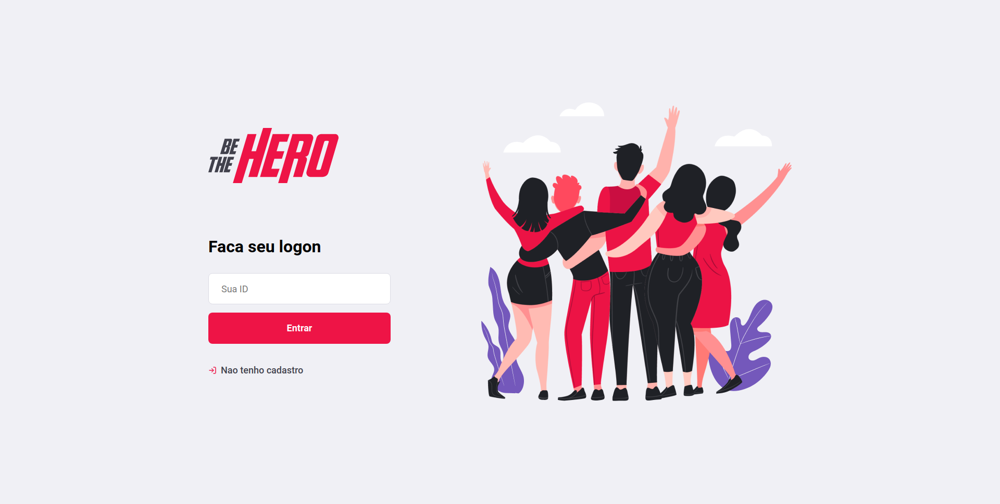
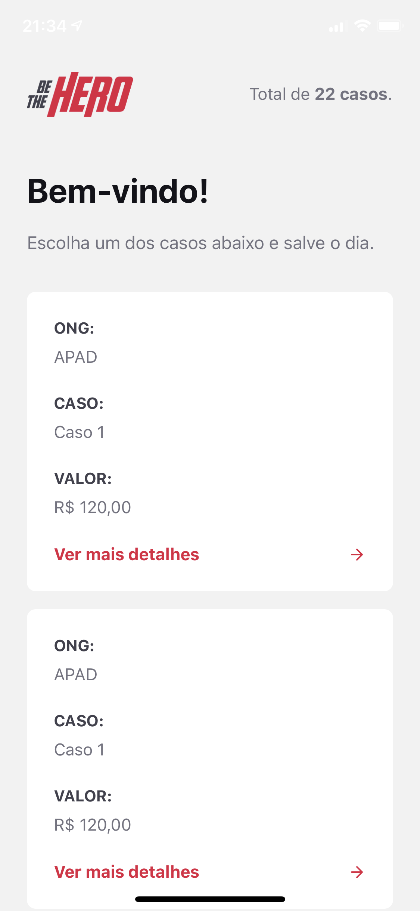

# OmniStack week - NGOs application

In this project was developed an application with a web interface and mobile interface interacting with a Node.js server.

## App summary

A NGO can register itself using the NGO's name, e-mail, WhatsApp number, the city and the state. After that will generate an ID with 8 characters that the NGO will use to login. In the NGO's profile is possible to see all the NGO's incidents and register new incidents with the title, description and the value needed to resolve the incident. At the mobile app you will see all the incidents recorded by the NGOs and the details of each one with the number and e-mail to contact.

### Technologies used

- [Node.js](https://nodejs.org/) - platform built on Chrome's JavaScript runtime
- [Express](https://www.npmjs.com/package/express) - web application framework for Node.js
- [Celebrate](https://www.npmjs.com/package/celebrate) - a joi validation middleware for Express
- [Knex](https://www.npmjs.com/package/knex) -  a "batteries included" SQL query builder for SQL DBs
- [SQLite3](https://www.npmjs.com/package/sqlite3) - relational database management system
- [React](https://reactjs.org/) - JavaScript library for building user interfaces
- [React Native](https://reactnative.dev/) - open-source mobile application framework
- [Jest](https://www.npmjs.com/package/jest) - JavaScript Testing Framework
- [supertest](https://www.npmjs.com/package/supertest) - provide a high-level abstraction for testing HTTP

### Getting Started

#### Starting the back-end

```
$ cd ./backend
$ npm install
$ npm start
```

#### Starting the front-end

```
$ cd ./frontend
$ npm install
$ npm start
```

#### Starting the mobile application

```
$ cd ./mobile
$ npm install
$ npm start
```
Was developed using [Expo](https://expo.io/). You have to have the Expo application in the iOS or Android or use an emulator or using the [Expo Snack](https://snack.expo.io/).

### Screen images 

#### WEB main page

<p align="center">
  
</p>


#### Mobile main page

<p align="center">
  
</p>